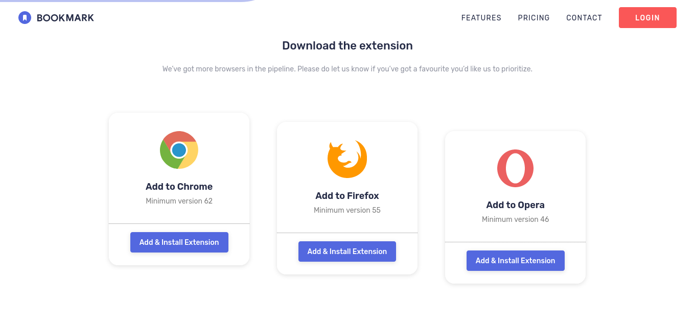

# Bookmark Landing Page

This is a solution to the Bookmark Landing Page challenge from [Frontend Mentor](https://www.frontendmentor.io). The goal of this project is to build a responsive landing page that closely matches the given design. This challenge allows for flexibility in choosing any tools or frameworks for implementation, providing an opportunity to practice and improve skills in web development.

## Table of Contents

- [Overview](#overview)
  - [Features](#features)
  - [Screenshot](#screenshot)
  - [Links](#links)
- [My Process](#my-process)
  - [Built With](#built-with)
  - [What I Learned](#what-i-learned)
  - [Continued Development](#continued-development)
- [Author](#author)
- [Acknowledgments](#acknowledgments)

## Overview

### Features

Users should be able to:

- View the optimal layout for the interface depending on their device's screen size
- See hover and focus states for all interactive elements on the page
- Receive an error message when the newsletter form is submitted if:
  - The input field is empty
  - The email address is not formatted correctly

### Screenshot

_Add screenshots of your project here to showcase your final output. You can include images of both the mobile and desktop designs for comparison._

### Links

- Solution URL: [Frontend Mentor Solution](https://github.com/arzaqulmughny/bookmark-landing-page)
- Live Site URL: [Bookmark Landing Page Live Demo](https://arzaqulmughny.github.io/bookmark-landing-page/)

## My Process
1. **Reading and Understanding the Requirements**  
   The first step was carefully reviewing the challenge requirements to ensure I fully understood the key features and functionality that needed to be implemented. This included understanding the behavior of the form validation, responsiveness, and hover/focus states for interactivity.

2. **Planning Based on Design**  
   After understanding the requirements, I examined the design files and planned the structure of the webpage. I broke down the page into smaller components and sections, such as the header, features section, download buttons, and footer, ensuring that the layout would be optimized for both mobile and desktop views.

3. **Preparing Assets and Starting the Development**  
   Once the planning was complete, I gathered all necessary assets such as images, fonts, and icons. With everything ready, I began coding the layout using HTML and CSS, ensuring the design was pixel-perfect. Following that, I implemented the form validation logic and added JavaScript for enhanced interactivity.

### Built With

- Semantic HTML5 markup
- Vanilla CSS (No Framework)
- Mobile-first workflow
- Javascript - For interactive navbar
- Animate on Scroll (AOS)

### What I Learned

Through this challenge, I was able to practice:

- Building responsive layouts using CSS Grid and Flexbox
- Handling form validation in JavaScript to display appropriate error messages
- Enhancing accessibility with focus states and hover effects on interactive elements
- Working with media queries to ensure the design adapts to various screen sizes

One of the major challenges was ensuring that the design matched the original closely, particularly across different devices, while maintaining a smooth user experience.

### Continued Development

In future projects, I plan to explore HTML5 accessibility features, specifically focusing on ARIA (Accessible Rich Internet Applications). My goal is to ensure that all interactive elements and dynamic content are fully accessible to users with disabilities, improving the overall usability and inclusivity of my web applications.

## Author

- Website - [Arzaqul Mughny](https://arza.vercel.app)
- Frontend Mentor - [@arzaqulmughny](https://www.frontendmentor.io/profile/arzaqulmughny)

## Acknowledgments

A big thank you to [Frontend Mentor](https://www.frontendmentor.io) for providing this challenge. It's a great way to practice front-end skills and learn new techniques.

